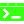

### Hey, I am Gabriel 👋

## a web developer

- 🌱 Currently learning everything 📚🐒
- 🥅 2021 Goals: Contribute to Open Source projects

### Connect with me:

[][linkedin]
[][twitter]

 

### Languages and Tools:

 
 

[linkedin]: https://www.linkedin.com/in/gabrielmijares
[twitter]: https://twitter.com/@gabrielml05
